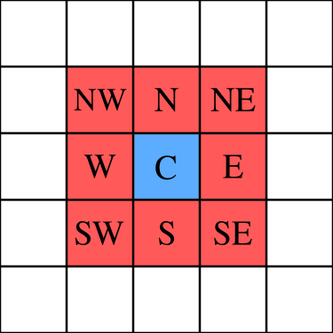

# Introduction - Conways's Game of Life

Game of Life is a cellular automaton invented by John Horton Conway in 1970. The game is a zero-player game, which means that the user does not interact with the game except when creating its initial state. The game may also be implemented so that a random seed is generated every time the game is initialized, requiring no user input for the initial configuration of the grid.

# Rules

Underpopulation

- Any live cell with 0 or 1 live neighbours becomes dead. 

Still lives

-Any live cell with 2 or 3 live neighbours stays alive.

Overpopulation

-Any live cell with 3 or more neighbours becomes dead.

Reproduction

-Any dead cell with exactly 3 or more neighbours becomes alive.

Moore Neighborhood: is defined on a two-dimensional square lattice and is composed of a central cell that surrounds it. Moore Neighborhood evaluates the state of the 8 adjacent cells to determine the fate of the central one.

